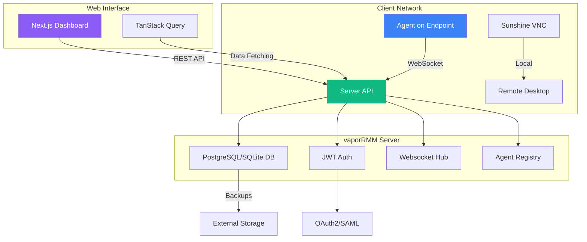
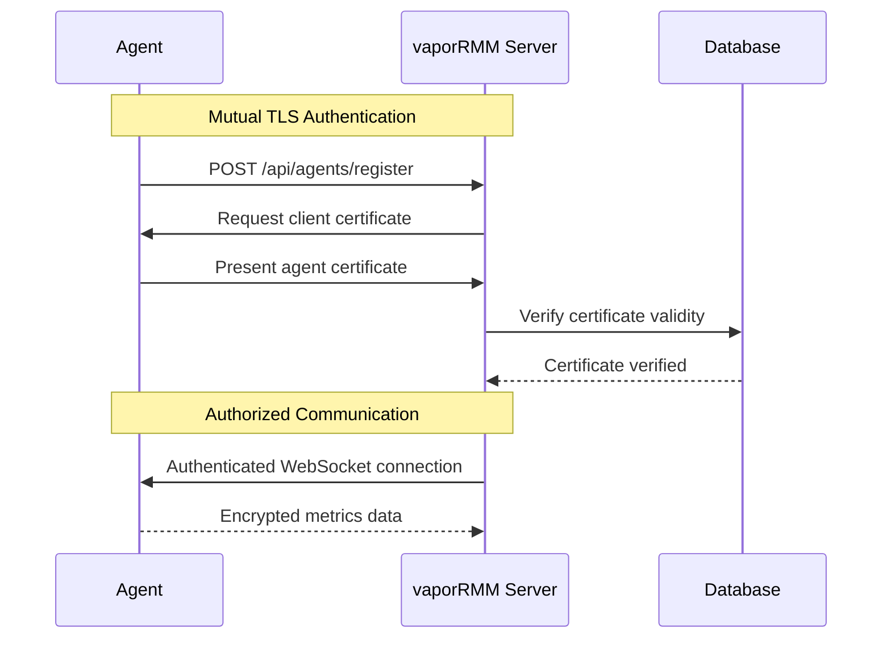

# vaporRMM - Remote Monitoring & Management


[](https://goreportcard.com/report/github.com/vaporrmm/vaporrmm)
[](https://hub.docker.com/r/vaporrmm)

**vaporRMM** is a comprehensive, open-source Remote Monitoring and Management platform designed for IT professionals, MSPs, and DevOps teams. Built with modern technologies, it provides real-time system monitoring, automated patch management, remote desktop access, and security compliance tracking.

---

## 🌟 Features

| Dashboard | Server | Agent |
|-----------|--------|-------|
| **Dashboard Overview** — Real-time device status, alerts, and resource metrics | **Server Architecture** — Go backend with SQLite/PostgreSQL, REST API, WebSocket hub | **Agent Deployment** — Cross-platform agent with heartbeat, command execution, file transfer |

### Core Capabilities

- **Real-time Monitoring** - CPU, memory, disk, network metrics with configurable alerts
- **Remote Desktop** - Secure VNC/WebRTC access via Sunshine backend
- **Patch Management** - Automated OS and application updates across your fleet
- **Security Compliance** - Continuous vulnerability scanning and reporting
- **Script Execution** - Run PowerShell/Bash scripts on remote systems
- **Inventory Tracking** - Hardware/software inventory with custom attributes
- **Multi-Tenant** - Support for MSPs managing multiple clients

---

## 🏗 Architecture



### Technology Stack

| Layer | Technology |
|-------|-----------|
| Frontend | Next.js 15 (App Router), TypeScript, TailwindCSS, shadcn/ui |
| State Management | TanStack Query, WebSocket |
| Backend API | Go + Fiber Framework |
| Database | SQLite (dev), PostgreSQL (production) |
| Remote Desktop | Sunshine API (localhost:47990) |
| Agent | Go + WebSockets |

---

## 🚀 Quick Start

### Prerequisites

- **Docker & Docker Compose** (v2.0+)
- **Node.js 18+** (for local development)
- **Go 1.21+** (for building agents)

### Docker Deployment

```bash
# Clone the repository
git clone https://github.com/vaporrmm/vaporrmm.git
cd vaporrmm

# Start all services
docker-compose up -d

# View logs
docker-compose logs -f

# Access dashboard
open http://localhost:3000
```

### Manual Installation

```bash
# Build and run the server
cd packages/server
go build -o vaporrmm-server .
./vaporrmm-server

# Install the agent on target systems
curl -fsSL https://raw.githubusercontent.com/vaporrmm/vaporrmm/main/packages/cli/install.sh | bash
```

---

## 📋 Installation Guide

### Option 1: Docker (Recommended for Production)

```yaml
# docker-compose.yml
version: '3.8'
services:
  server:
    image: vaporrmm/server:latest
    ports:
      - "8080:8080"
    volumes:
      - ./data:/app/data
      - ./certs:/app/certs
    environment:
      - DATABASE_URL=sqlite:///app/data/vaporrmm.db
      - JWT_SECRET=your-secret-key-here
    restart: unless-stopped

  agent:
    image: vaporrmm/agent:latest
    volumes:
      - /var/run/dbus:/var/run/dbus
    environment:
      - SERVER_URL=http://server:8080
      - AGENT_ID=${HOSTNAME}
    privileged: true
```

### Option 2: Direct Binary Installation

```bash
# Linux/macOS
curl -L https://github.com/vaporrmm/vaporrmm/releases/latest/download/vaporrmm-linux-amd64.tar.gz | tar xz
sudo mv vaporrmm-server /usr/local/bin/

# Windows (PowerShell)
Invoke-WebRequest -Uri "https://github.com/vaporrmm/vaporrmm/releases/latest/download/vaporrmm-windows-amd64.zip" -OutFile vaporrmm.zip
Expand-Archive vaporrmm.zip -DestinationPath $env:PROGRAMFILES\vaporrmm
```

### Option 3: Package Managers

```bash
# Debian/Ubuntu
curl -fsSL https://repo.vaporrmm.com/gpg.key | sudo gpg --dearmor -o /usr/share/keyrings/vaporrmm-archive-keyring.gpg
echo "deb [signed-by=/usr/share/keyrings/vaporrmm-archive-keyring.gpg] https://repo.vaporrmm.com/deb stable main" | sudo tee /etc/apt/sources.list.d/vaporrmm.list
sudo apt update && sudo apt install vaporrmm-server

# RHEL/CentOS/Fedora
sudo dnf install dnf-plugins-core
sudo dnf config-manager --add-repo https://repo.vaporrmm.com/rpm/vaporrmm.repo
sudo dnf install vaporrmm-server
```

---

## 🔐 Security

### Security Checklist

| Item | Status | Notes |
|------|--------|-------|
| TLS/HTTPS | ✅ | Required in production |
| mTLS for Agents | ✅ | Agent certificates validated |
| JWT Authentication | ✅ | HS256 with configurable secret |
| Secret Management | ✅ | Environment variables, Vault support |
| Audit Logging | ✅ | All admin actions logged |
| API Rate Limiting | ✅ | 100 req/min default |

### Security Best Practices

```bash
# Enable mTLS for agent communication
export AGENT_MTLS=true
export AGENT_CERT=/etc/vaporrmm/agent.crt
export AGENT_KEY=/etc/vaporrmm/agent.key

# Configure secure secrets (never commit to git!)
export JWT_SECRET=$(openssl rand -base64 32)
export DATABASE_PASSWORD=$(openssl rand -base64 16)

# Enable TLS with custom certificates
export SERVER_CERT=/etc/vaporrmm/server.crt
export SERVER_KEY=/etc/vaporrmm/server.key
```

### Security Architecture



---

## 📊 Configuration

### Environment Variables

| Variable | Default | Description |
|----------|---------|-------------|
| `SERVER_PORT` | 8080 | API server port |
| `DATABASE_URL` | sqlite:///data/vaporrmm.db | Database connection string |
| `JWT_SECRET` | (required) | Secret for JWT token signing |
| `CORS_ORIGINS` | * | Allowed CORS origins |
| `LOG_LEVEL` | info | Log verbosity (debug, info, warn, error) |

### Config File (`vaporrmm.yml`)

```yaml
server:
  port: 8080
  host: "0.0.0.0"
  
database:
  type: sqlite
  path: /var/lib/vaporrmm/data.db
  
security:
  mtls_enabled: true
  jwt_expiry: 24h
  refresh_token_expiry: 720h

agent:
  heartbeat_interval: 30s
  checkin_timeout: 180s
  
webhook:
  enabled: true
  events:
    - agent_connected
    - agent_disconnected
    - security_alert
```

---

## 🛠 Development

### Prerequisites

- **Go 1.21+**
- **Node.js 18+**
- **pnpm 8+**

### Setup

```bash
# Clone repository
git clone https://github.com/vaporrmm/vaporrmm.git
cd vaporrmm

# Install dependencies
pnpm install

# Generate shadcn/ui components
npx shadcn-ui@latest add button card input form label select

# Start development servers
pnpm dev:dashboard  # Next.js on port 3000
pnpm dev:server     # Go API on port 8080
```

### Project Structure

```
vaporrmm/
├── apps/
│   └── dashboard/           # Next.js 15 App Router frontend
├── packages/
│   ├── server/              # Go/Fiber REST API
│   │   ├── cmd/            # Main entry points
│   │   ├── internal/       # Internal packages
│   │   │   ├── db/         # Database layer
│   │   │   └── handlers/   # HTTP handlers
│   │   └── pkg/            # Reusable server packages
│   ├── agent/              # Go agent for endpoints
│   └── cli/                # CLI tool for installation
├── docker/
│   ├── server/Dockerfile
│   ├── agent/Dockerfile
│   └── dashboard/Dockerfile
└── scripts/                 # Build and deployment scripts
```

---

## 🧪 Testing

```bash
# Run all tests
pnpm test

# Test specific packages
pnpm test:server      # Go server tests
pnpm test:agent       # Agent integration tests
pnpm test:e2e         # End-to-end tests

# Code coverage
pnpm test:coverage    # Generate coverage report
```

---

## 📦 Building

### Docker Images

```bash
# Build all images
docker-compose build

# Build individual image
docker build -f docker/server/Dockerfile -t vaporrmm/server .
docker build -f docker/agent/Dockerfile -t vaporrmm/agent .

# Push to registry
docker push vaporrmm/server:latest
```

### Native Binaries

```bash
# Linux
go build -o vaporrmm-server ./packages/server/main.go
go build -o vaporrmm-agent ./packages/agent/main.go

# Cross-platform
GOOS=windows GOARCH=amd64 go build -o vaporrmm-server.exe ./packages/server/main.go
GOOS=darwin GOARCH=arm64 go build -o vaporrmm-darwin-arm64 ./packages/server/main.go
```

---

## 📝 API Documentation

Once the server is running, visit:

- **Swagger UI**: `http://localhost:8080/swagger`
- **OpenAPI Spec**: `http://localhost:8080/api/openapi.json`

### Authentication

```bash
# Login to get JWT token
curl -X POST http://localhost:8080/api/auth/login \
  -H "Content-Type: application/json" \
  -d '{"email":"admin@vaporrmm.local","password":"your-password"}'

# Use token in subsequent requests
curl http://localhost:8080/api/agents \
  -H "Authorization: Bearer YOUR_JWT_TOKEN"
```

---

## 🤝 Contributing

We welcome contributions from the community! Here's how you can help:

1. **Fork** the repository
2. Create a feature branch (`git checkout -b feature/amazing-feature`)
3. Commit your changes (`git commit -m 'Add some amazing feature'`)
4. Push to the branch (`git push origin feature/amazing-feature`)
5. Open a Pull Request

### Contributing Guidelines

- All code must pass linting and tests
- Follow Go formatting standards (`gofmt`, `goimports`)
- Update documentation for new features
- Add unit tests for new functionality

---

## 📄 License

This project is licensed under the **GNU Affero General Public License v3.0 (AGPL-3.0)**.

```
vaporRMM - Remote Monitoring & Management Platform
Copyright (C) 2024 vaporRMM Contributors

This program is free software: you can redistribute it and/or modify
it under the terms of the GNU Affero General Public License as published by
the Free Software Foundation, either version 3 of the License, or
(at your option) any later version.

This program is distributed in the hope that it will be useful,
but WITHOUT ANY WARRANTY; without even the implied warranty of
MERCHANTABILITY or FITNESS FOR A PARTICULAR PURPOSE. See the
GNU Affero General Public License for more details.

You should have received a copy of the GNU Affero General Public License
along with this program. If not, see <https://www.gnu.org/licenses/>.
```

### Commercial Licensing

For organizations that cannot comply with AGPL requirements, commercial licensing options are available. Contact [license@vaporrmm.com](mailto:license@vaporrmm.com) for pricing and terms.

---

## 📞 Support & Community

- **GitHub Issues**: [Report bugs and request features](https://github.com/vaporrmm/vaporrmm/issues)
- **Discord**: [Join our community server](https://discord.gg/vaporrmm)
- **Documentation**: [Full documentation](https://docs.vaporrmm.com)
- **Twitter**: [@vaporrmm](https://twitter.com/vaporrmm)

---

## 🙏 Acknowledgments

- [Sunshine](https://github.com/loki-47-6F-64/sunshine) for remote desktop functionality
- [Fiber](https://gofiber.io/) for the Go web framework
- [Next.js](https://nextjs.org/) for the frontend framework
- All our [contributors](https://github.com/vaporrmm/vaporrmm/graphs/contributors)

---

## ⭐ Show your support

Give a ⭐️ if you like this project!

[](https://star-history.com/#vaporrmm/vaporrmm&Date)