# Vaporware RMM

[](https://github.com/tabiznet/VaporwareRMM/actions/workflows/ci.yml)
[](LICENSE)
[](https://github.com/tabiznet/VaporwareRMM/releases)

Self-hosted Remote Monitoring & Management for MSPs and small ops teams. Multi-tenant by design. Sunshine + Moonlight for remote desktop. Tailscale for agent transport.

> ## ⚠️ ALPHA SOFTWARE — USE AT YOUR OWN RISK
>
> This is **pre-1.0 alpha software**. It is published for evaluation, hobbyist
> deployments, and security research. **Do not run it on production fleets,
> over the public internet, or against systems containing data you cannot
> afford to lose**, until you have personally audited the code paths you
> depend on.
>
> Specifically, the project ships with:
>
> - No external security audit. Self-audited only.
> - No upgrade path or migration guarantees between alpha releases. Schema
>   migrations may break; back up before pulling.
> - No long-term support. APIs, env vars, install scripts, and database
>   schema may change without notice.
> - Limited multi-node testing. Single-node deployments are the supported
>   path; multi-node Redis fan-out is implemented but lightly exercised.
> - **No warranty of any kind.** See `LICENSE` (AGPL-3.0).
>
> Found a vulnerability? Email **`security@tcitsys.com`**. Do not open a
> public issue. See [`SECURITY.md`](SECURITY.md) for scope + disclosure
> policy.

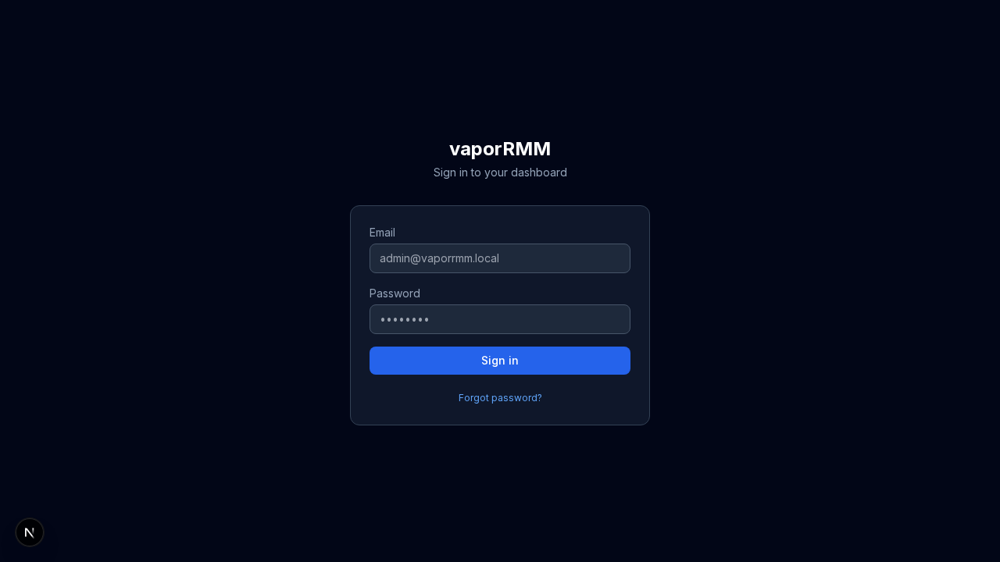

---

## Features

### Core

- **Multi-tenant from the ground up.** Every row carries a `tenant_id`. Super-admin sees everything; tenant admins see only their own. Cross-tenant access denied at the SQL layer, not just the UI.
- **Agent fleet management.** Cross-platform agents (Linux amd64/arm64, Windows amd64, macOS amd64/arm64). Install with one command. Persistent bearer token, 30s heartbeat, auto-reconnect.
- **Remote desktop via Sunshine + Moonlight.** Per-device install + status. Pairing PIN flow. Optional Moonlight Web for in-browser streaming.
- **Tailscale integration.** Per-tenant auth-key generation, agent install, status reporting.
- **Real-time dashboard.** WebSocket events fan out to dashboard clients filtered by tenant + role. Multi-node deployments supported via Redis pub/sub.

### Auth & Security

- **Roles**: `super_admin` (cross-tenant) > `admin` (tenant-scoped) > `user` (read + own devices).
- **TOTP / 2FA** with single-use backup codes. Pre-TOTP sessions invalidated on enable.
- **JWT** (HMAC-SHA256) cookie-only sessions; stateful — every request checks `user_sessions`.
- **CSRF** double-submit cookie on state-changing requests.
- **Per-tenant agent registration secrets** (SHA-256 hashed at rest). Plaintext shown once.
- **AES-256-GCM encryption at rest** for SMTP passwords + webhook secrets.
- **Tenant suspension** with operator-configurable grace period.
- **Self-serve signup** (gated by `SIGNUP_OPEN=1` or `SIGNUP_INVITE_CODE`).
- **User invites** via email with one-time token (7-day TTL).
- **Tenant impersonation** for super-admin support: enter a tenant as `tenant_admin`, original identity tracked, audit-logged on start + end.
- **Rate limiting** with priority `agent > tenant > IP` so noisy fleets don't strangle dashboards.

### Operations

- **Backup + restore** scripts for SQLite and PostgreSQL with documented drill procedure (see [docs/BACKUP_RESTORE.md](docs/BACKUP_RESTORE.md)).
- **Tenant data export** (JSON dump, sensitive fields excluded) for offboarding.
- **Tenant purge** (right-to-erasure) including user-keyed tables.
- **Per-tenant Prometheus metrics**: `vaporrmm_tenant_devices`, `..._online`, `..._users`, plus global counters.
- **Caddy on-demand TLS** for tenant subdomains (`*.rmm.example.com`) with `/caddy/ask` gate.
- **Integration probes** for Tailscale CLI, Sunshine release URL, Moonlight web.
- **Production runbook** with first-boot, scaling, and DR procedures (see [docs/PRODUCTION.md](docs/PRODUCTION.md)).

### Tested

- Go unit + integration tests (SQLite + PostgreSQL via ephemeral Docker rig).
- Cross-tenant isolation tests verifying read/write boundaries.
- Playwright E2E covering login, TOTP, tenant CRUD, install-secret reveal.
- k6 load tests: 100 concurrent agents heartbeating @ p95 < 200ms, 10 dashboard users @ p95 < 300ms.

---

## Screenshots

### Sign-in


### Dashboard

Operator overview: fleet pulse (online / offline / open tickets / active alerts), 24h resource utilisation, recent activity, alert + ticket queues, and a 10-row device table with quick remote/Tailscale handles.

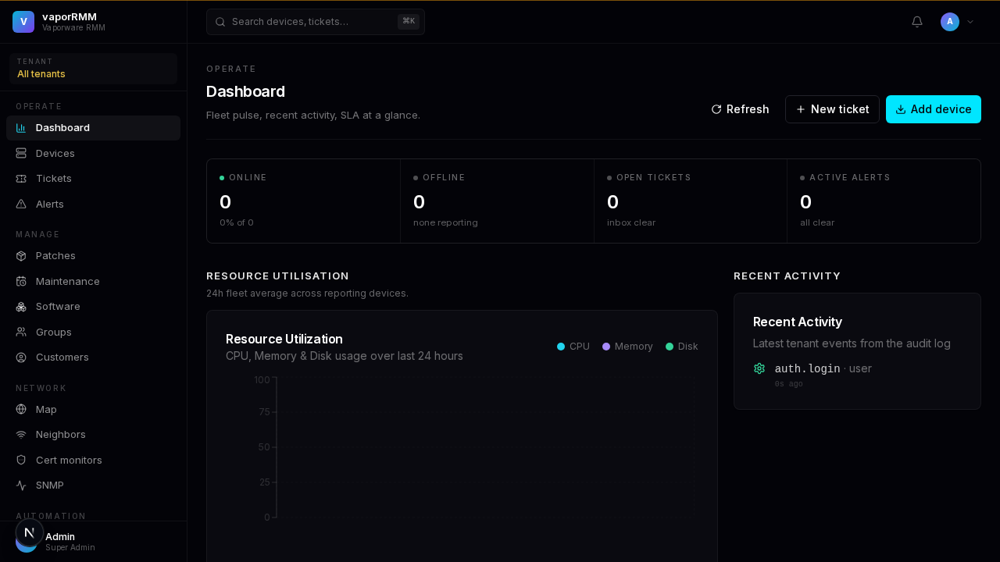

### Devices

Filterable fleet table — toggle `Online`, `Offline`, `Warning`, plus inline hostname / IP / OS search. Each row links to the device detail surface (overview, command history, files, software inventory).

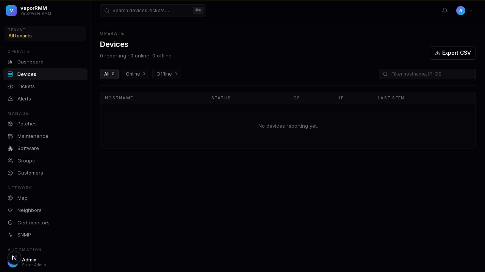

### Tickets

Open / All tabs. Severity pill, status pill, inline status switcher per row. New ticket opens a right-side sheet, never a modal.

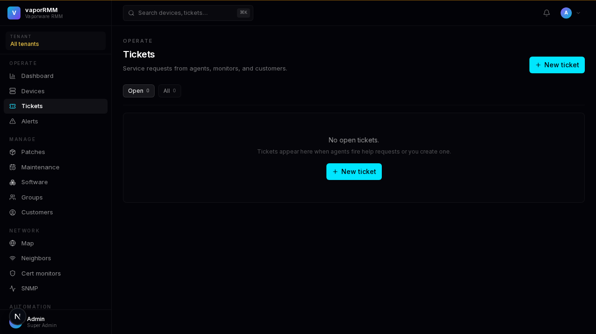

### Alerts

Active / Resolved / All views. Severity-coloured pills go through a single tone helper so every status indicator looks identical across pages.

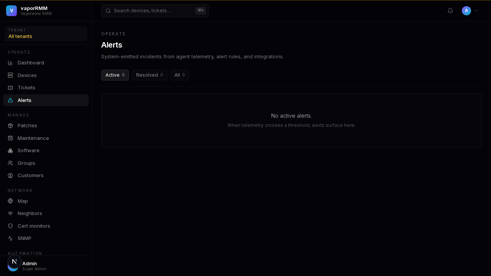

### Patches

OS + third-party updates discovered by agents. Severity, install status, KB / source, and CVE rendered inline; one-click install or mark-installed per row.

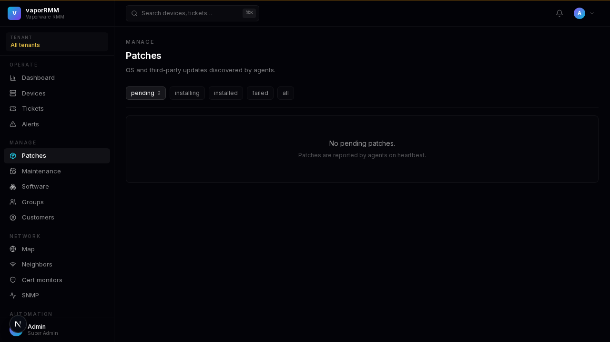

### Network map

Tailscale tailnet + device connectivity. Switch between graph and list view. Vital-signs row shows total devices, Tailscale installed, Tailscale connected.

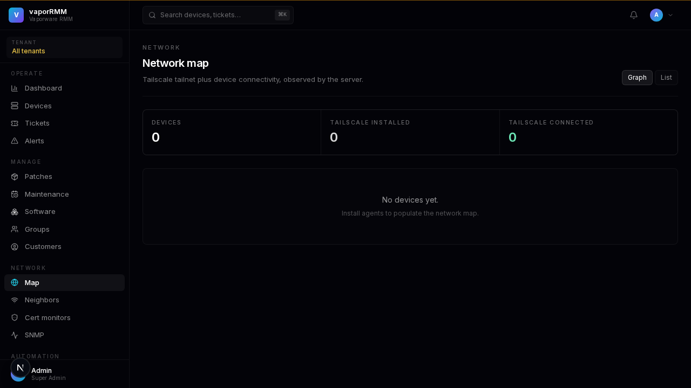

### Command palette (⌘K)

Global jump nav across pages, devices, and tickets. Fuzzy match with word-boundary boost; ↑↓ to navigate, ↵ to open.

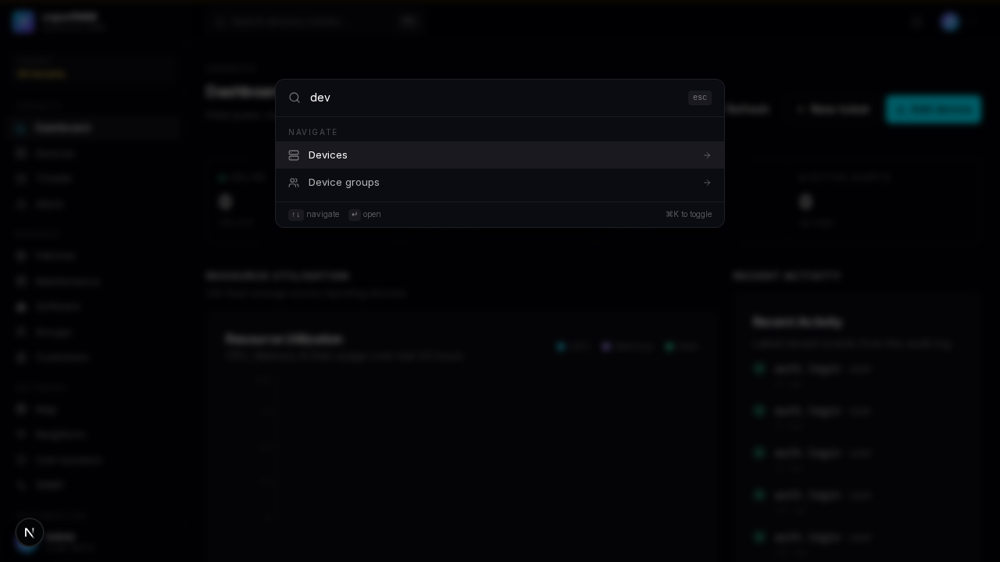

### Settings · Security

Per-user TOTP enrollment with QR code + 8 single-use backup codes shown once. Tabbed sidebar layout: General, Branding, Agents, Sessions, Security.

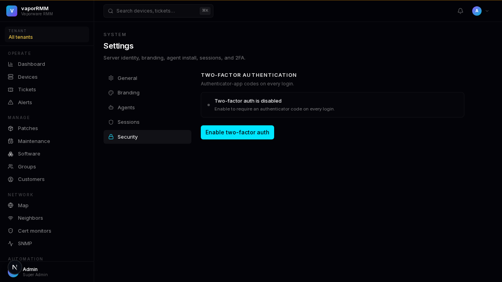

### Audit log

Compact dense table. Every admin action is logged: action, resource, details, IP, with action / resource filters and configurable row limits.

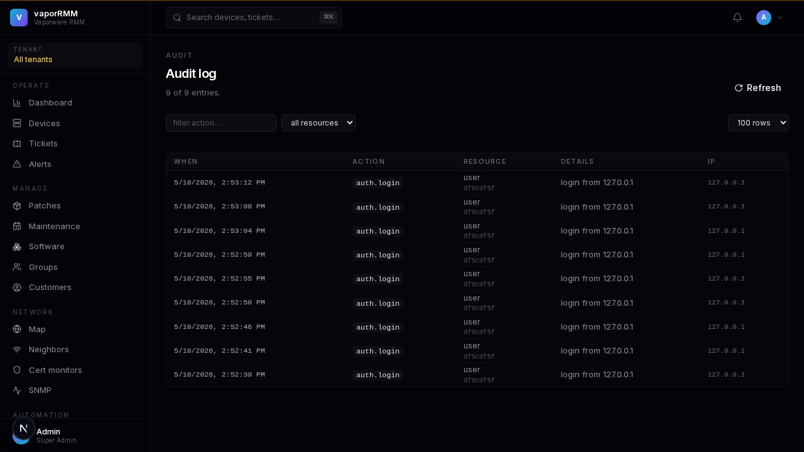

### Tenants admin

Cross-tenant view, super-admin only. Tenant name + slug, plan, device + user counts, age. Per-row actions: rotate registration secret, impersonate, suspend, delete.

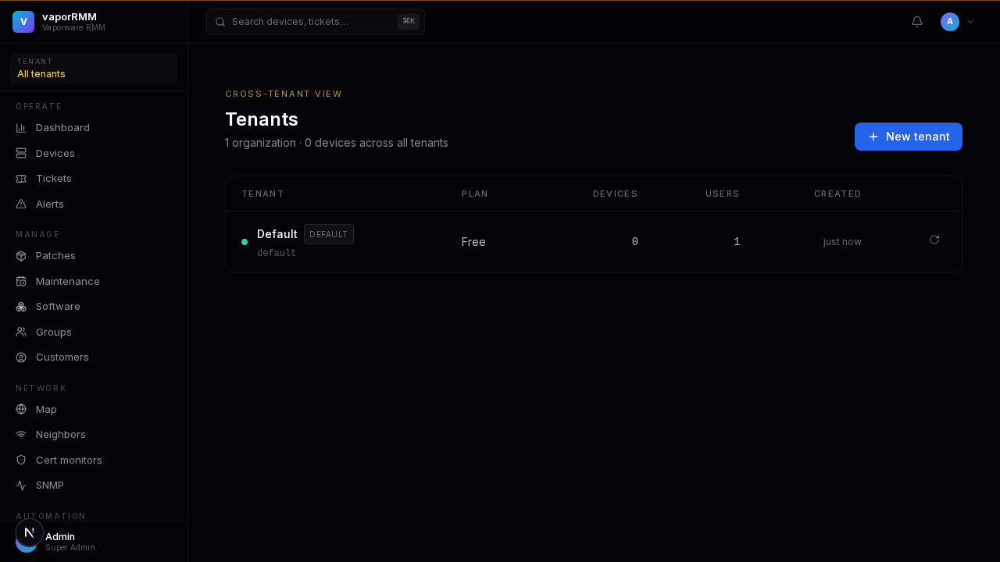

### AI capability ladder + guardrails

| Tier | Stage | Default rung | Notes |
|------|-------|--------------|-------|
| Observation | 1 | shadow | alert dedup + correlation; ticket clustering; predictive failure |
| Assistance | 2 | suggest | NL fleet search; script gen; ticket triage on intake |
| Action | 3 | shadow | playbook framework + auto-remediation w/ rollback orchestrator |
| Autonomous | 4 | act_low* | persistent probe queue; auto-routing; precision-floor demote |

`*` Autonomous-rung capabilities auto-demote to `act_policy` when 14-day precision drops below threshold (configurable; min-samples gated). Promotion past `suggest` is super-admin only. Multi-level kill switches (global / per-tenant / per-capability) cached in memory + invalidated via Redis pub/sub. Per-(tenant, capability) blast-radius cap with sliding window. Provider keys encrypted at rest via AES-256-GCM; audit rows carry write-once HMAC signatures.

---

## Quick start (Docker, Linux)

Prerequisites: Docker + Docker Compose, a domain with DNS control if you want real TLS, an SMTP relay if you want password reset emails.

### 1. Clone + secrets

```bash
git clone https://github.com/tabiznet/VaporwareRMM /srv/vaporrmm
cd /srv/vaporrmm

mkdir -p secrets
openssl rand -hex 32 > secrets/jwt_secret.txt
ENCRYPTION_KEY="$(openssl rand -base64 32)"
ADMIN_PW="$(openssl rand -base64 24 | tr -d '/+=' | head -c 24)Aa1!"
PG_PW="$(openssl rand -base64 24 | tr -d '/+=' | head -c 24)"
```

### 2. `.env` (repo root)

```bash
DOMAIN=localhost                 # or rmm.yourdomain.com
ACME_EMAIL=ops@yourdomain.com    # for Let's Encrypt
PUBLIC_URL=https://localhost     # used for password-reset + invite links

POSTGRES_PASSWORD=$PG_PW
JWT_SECRET=$(cat secrets/jwt_secret.txt)
SECRETS_ENCRYPTION_KEY=$ENCRYPTION_KEY
ADMIN_PASSWORD=$ADMIN_PW

# Optional but recommended
REGISTRATION_SECRET=                # set to lock down agent registration
SUSPENSION_GRACE_HOURS=72           # warning banner before hard-block
SIGNUP_INVITE_CODE=                 # set to enable gated signup
CORS_ORIGINS=https://localhost
```

Save the values you can't recover (`ADMIN_PASSWORD`, `JWT_SECRET`, `SECRETS_ENCRYPTION_KEY`) to a password manager. Losing `SECRETS_ENCRYPTION_KEY` means SMTP passwords + TOTP secrets become unrecoverable.

### 3. Bring up the stack

```bash
docker compose up -d
docker compose logs -f server     # wait for "starting server" + migration lines
```

### 4. Verify

```bash
curl -k https://localhost/health           # → 200 {"status":"ok"}
curl -k https://localhost/api/branding/    # → default branding JSON
```

Open `https://localhost` in a browser. Log in as `admin@vaporrmm.local` with the `ADMIN_PASSWORD` you set.

### 5. Hardening (do today, not next month)

1. Settings → Users → change the default admin's email
2. Settings → Security → enable TOTP, save the 8 backup codes somewhere safe
3. `make test-postgres` against your live DB to verify migrations applied cleanly
4. Run a backup → restore drill ([docs/BACKUP_RESTORE.md](docs/BACKUP_RESTORE.md))

---

## Quick start (dev, no Docker)

```bash
# Server
cd packages/server
JWT_SECRET=dev-secret-key-that-is-long-enough \
  ADMIN_PASSWORD='DevTime123!' \
  DATABASE_PATH=/tmp/vaporrmm.db \
  go run .

# In a second shell — dashboard
cd apps/dashboard
NEXT_PUBLIC_API_URL=http://localhost:8080/api \
  npm run dev
```

Server on `:8080`, dashboard on `:3000`. The dashboard expects the server's CORS to include `http://localhost:3000` — set `CORS_ORIGINS` if needed.

---

## Onboarding a tenant

1. **Tenants → New tenant.** Set name, slug. Hit Create.
2. **Install command panel** appears once. Pick Linux / macOS / Windows tab. Copy the command.
3. Run it on each managed machine (Linux/macOS as root via `sudo`; Windows in PowerShell as Admin):

```bash
# Linux / macOS
curl -fsSL https://rmm.yourdomain.com/api/branding/agent-install?format=script \
  | sudo REGISTRATION_SECRET='vrt_xxxxx' bash -s -- --server https://rmm.yourdomain.com
```

```powershell
# Windows (PowerShell as Administrator) — the dashboard supplies the full snippet
$env:REGISTRATION_SECRET='vrt_xxxxx'
# downloads agent.exe, persists token + env file, registers Windows service
```

The agent registers exactly once with the registration secret, persists its bearer token to `/etc/vaporrmm/agent_token` (Linux/macOS) or `%ProgramData%\vaporrmm\` (Windows), then heartbeats every 30 seconds.

---

## Architecture

```
                     ┌───────────────────┐
                     │  Caddy (TLS)      │
                     │  on-demand certs  │
                     └─────────┬─────────┘
                               │
            ┌──────────────────┼──────────────────┐
            │                  │                  │
            ▼                  ▼                  ▼
   ┌──────────────┐    ┌──────────────┐    ┌──────────────┐
   │  Dashboard   │    │  Go API      │    │  Agents      │
   │  Next.js 15  │◄──►│  Fiber       │◄──►│  (managed    │
   │  React 19    │    │              │    │   machines)  │
   └──────────────┘    └──────┬───────┘    └──────────────┘
                              │
                  ┌───────────┴───────────┐
                  │                       │
                  ▼                       ▼
          ┌──────────────┐        ┌──────────────┐
          │  PostgreSQL  │        │  Redis       │
          │  (or SQLite  │        │  (rate limit │
          │   for dev)   │        │   + WS pub)  │
          └──────────────┘        └──────────────┘
```

- **Server** (`packages/server`) — Go Fiber, JWT auth, CSRF, multi-tenant data layer, REST + WebSocket.
- **Dashboard** (`apps/dashboard`) — Next.js 15, App Router, TailwindCSS, shadcn/ui.
- **Agent** (`packages/agent`) — Cross-platform Go binary, gopsutil for system metrics.
- **CLI** (`packages/cli`) — Management CLI.
- **Models** (`packages/models`) — Shared Go types between server + agent.

DB abstraction (`internal/db`) supports SQLite (dev/single-host) and PostgreSQL (production). The wrapper rewrites `?` placeholders to `$1, $2, ...` for Postgres so handlers stay portable.

---

## Make targets

```
make test            # unit + Postgres integration tests
make test-unit       # Go unit tests against SQLite
make test-postgres   # Go tests against ephemeral Postgres in Docker
make test-e2e        # Playwright end-to-end (boots full stack)
make test-load       # k6 load tests against $LOAD_BASE
make agent-build     # build local-arch agent → bin/agent
make agent-build-all # cross-build matrix (5 targets) → bin/agent-<os>-<arch>
make up-test-db      # start ephemeral Postgres on :5433
make down-test-db    # stop + wipe
make clean-bin       # rm -rf bin/
```

---

## Documentation

- [docs/PRODUCTION.md](docs/PRODUCTION.md) — full deployment runbook, monitoring, scaling, disaster recovery.
- [docs/BACKUP_RESTORE.md](docs/BACKUP_RESTORE.md) — backup schedule, restore procedure, drill checklist, RPO/RTO targets.
- [docs/AGENT_INSTALL.md](docs/AGENT_INSTALL.md) — per-OS agent install + troubleshooting.
- [PRODUCT.md](PRODUCT.md) — product positioning, anti-references, design intent.
- [DESIGN.md](DESIGN.md) — design system reference (palette, typography, motion).
- [CLAUDE.md](CLAUDE.md) — guidance for agentic coding tools working in this repo.

---

## Required environment

| Variable | Required | Purpose |
|---|---|---|
| `JWT_SECRET` | yes | Signs session JWTs. 32+ chars. Without it, sessions don't survive restart. |
| `SECRETS_ENCRYPTION_KEY` | for production | base64 32-byte key (`openssl rand -base64 32`). Encrypts SMTP passwords + TOTP secrets at rest. |
| `DATABASE_URL` | for Postgres | `postgres://user:pw@host:5432/db?sslmode=disable`. Falls back to SQLite when unset. |
| `DATABASE_PATH` | for SQLite | Path to SQLite file (default `./data/vapor_rmm.db`). |
| `ADMIN_PASSWORD` | optional | First-run admin password. Random + printed once if unset. |
| `PUBLIC_URL` | for production | Base URL for password-reset and invite links. |
| `CORS_ORIGINS` | for prod | Comma-separated allowed origins for the dashboard. |
| `REGISTRATION_SECRET` | optional | Fallback registration secret when no per-tenant secret matches. |
| `BASE_DOMAIN` | for subdomain routing | E.g. `rmm.example.com`. Drives tenant subdomain resolution + Caddy on-demand TLS. |
| `SUSPENSION_GRACE_HOURS` | optional | Hours of warning before hard-block on tenant suspension. Default 72. |
| `SUNSHINE_VERSION` | optional | LizardByte/Sunshine release tag. Validated; defaults to `v2025.628.4510`. |
| `MOONLIGHT_WEB_URL` | optional | If set, dashboard exposes in-browser streaming. |
| `SIGNUP_OPEN` | optional | Set `1` to enable open self-serve tenant signup. |
| `SIGNUP_INVITE_CODE` | optional | When set, signup requires this code in the request body. |
| `REDIS_URL` | for multi-node | `redis://host:6379`. Required for distributed rate limiting + cross-node WS broadcast. |
| `METRICS_API_KEY` | optional | If set, `/metrics` requires `Authorization: Bearer <key>` instead of admin JWT. |
| `SERVER_CERT` / `SERVER_KEY` | optional | Direct TLS termination on the Go server. Caddy is preferred. |
| `DISABLE_RATE_LIMIT` | tests only | Set `1` to bypass all rate limiting. Never in production. |

---

## Tech stack

- Go 1.23
- Fiber v2 + golang-jwt/jwt v5
- PostgreSQL 16 / SQLite via mattn/go-sqlite3
- Redis 7 (optional, multi-node)
- Caddy 2 (reverse proxy + on-demand TLS)
- Next.js 15 + React 19 + TailwindCSS
- Playwright (E2E) + k6 (load) + go test (unit/integration)
- Sunshine + Moonlight (LizardByte) for remote desktop
- Tailscale for agent transport

---

## License

AGPL-3.0. See `LICENSE`.

---

## Security disclosure

Found a vulnerability? Email **`security@tcitsys.com`**. Please don't open a public issue. See [`SECURITY.md`](SECURITY.md) for the full disclosure policy and threat-model scope.
